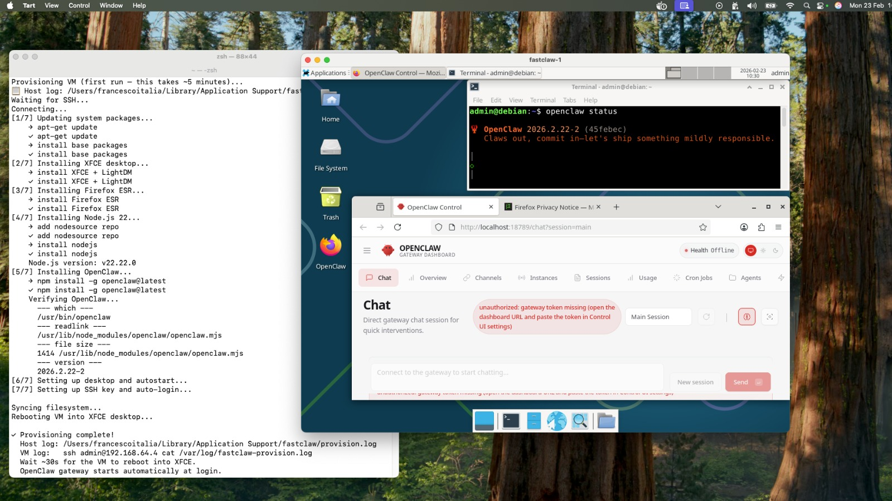

<p align="center">
  
</p>

# Fastclaw — OpenClaw/Linux VM for macOS

**You're on a Mac and you want to use OpenClaw on isolated VM/Linux.**
You don't want to deal with virtual machines, disk images, SSH keys, Linux desktops, or package managers.
Fastclaw does all of that for you — it creates a ready-to-use Linux VM with OpenClaw already installed and running.
One command. No Linux experience required.

## Installation

### Requirements

- macOS 13 or later
- Apple Silicon (M1/M2/M3/M4) or Intel

### Install - just one command

Open terminal and type :

```bash
curl -fsSL https://raw.githubusercontent.com/RomanSurface/FastClaw/main/scripts/install.sh | bash
```

> **First install takes ~10 minutes.** The script downloads a Debian VM, installs the graphical desktop and OpenClaw from scratch — be patient and let it finish.
>
> A **second window** will open showing the VM booting. **Don't touch it** — it will configure itself and start automatically when ready.

<p align="center">
  
</p>

That's it. The script installs everything you need, pulls the VM image, and launches OpenClaw.

---

## For Developers

> This section is for developers who want to build Fastclaw from source or work on the codebase.

### Build Requirements

- [Tart](https://tart.run): `brew install cirruslabs/cli/tart`
- Rust: `curl --proto '=https' --tlsv1.2 -sSf https://sh.rustup.rs | sh`
- `libssh2`: `brew install libssh2`

### Build from Source

```bash
cargo build --release
./target/release/fastclaw --help
```

> If the build fails on `ssh2`, add to `~/.cargo/config.toml`:
>
> ```toml
> [env]
> PKG_CONFIG_PATH = "/opt/homebrew/opt/libssh2/lib/pkgconfig"
> ```

### Commands

| Command                         | Description                           |
| ------------------------------- | ------------------------------------- |
| `fastclaw up [--number N]`      | Create, launch and provision VM       |
| `fastclaw up --headless`        | Run VM without graphical window       |
| `fastclaw up --with-playwright` | Also install Playwright + Chromium    |
| `fastclaw down <N>`             | Stop a running VM                     |
| `fastclaw delete <N>`           | Stop and delete VM + local state      |
| `fastclaw shell <N>`            | Open SSH shell into VM                |
| `fastclaw ip <N>`               | Print VM IP address                   |
| `fastclaw status [N]`           | Show status of one or all VMs         |
| `fastclaw image pull`           | Pull/refresh the base Debian 13 image |

### VM Details

| Property | Value                       |
| -------- | --------------------------- |
| OS       | Debian 13 Trixie (arm64)    |
| Desktop  | XFCE4 + LightDM (autologin) |
| Browser  | Firefox ESR                 |
| Node.js  | 22.x LTS                    |
| OpenClaw | latest (via npm)            |
| SSH User | `admin` / `admin`           |

### Architecture

```
fastclaw up
 ├── Pull Debian 13 base image (if needed)
 ├── tart clone → fastclaw-1
 ├── tart run → launch VM
 ├── Wait for VM IP
 └── SSH provisioning (first run only):
       ├── XFCE4 desktop + LightDM autologin
       ├── Firefox ESR + OpenClaw desktop shortcut
       ├── Node.js 22
       ├── OpenClaw (npm install -g)
       ├── fastclaw SSH key injection
       └── sync + reboot via SSH
```

### Logs

- **Host**: `~/Library/Application Support/fastclaw/provision.log`
- **VM**: `/var/log/fastclaw-provision.log`
